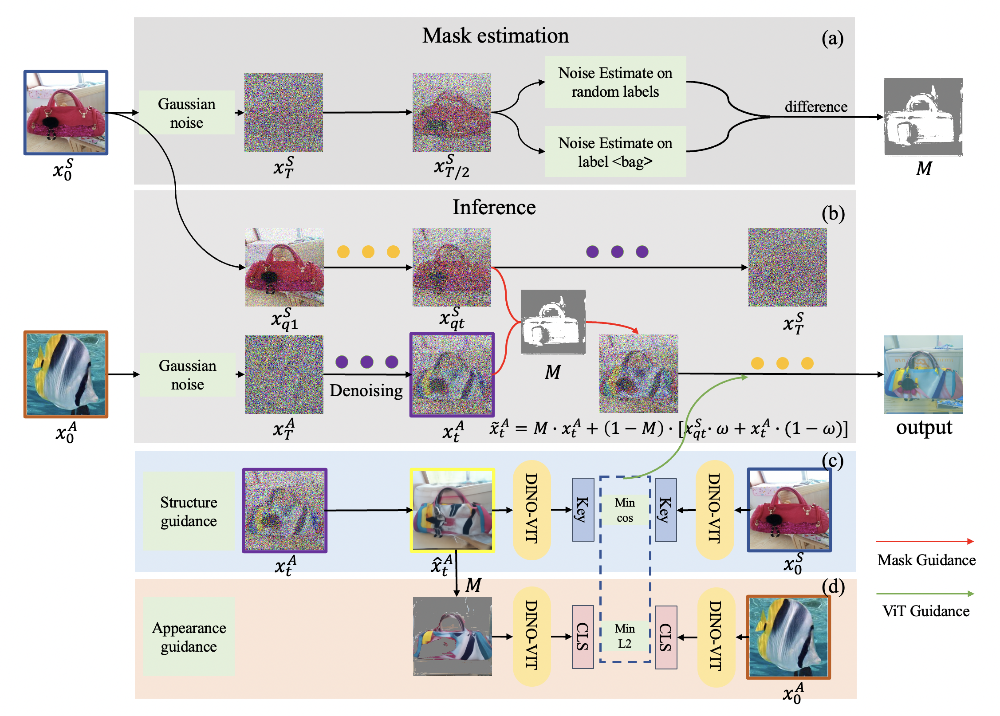
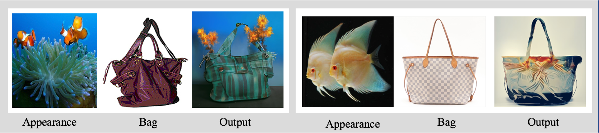

# DiffFashion

DiffFashion is a method for Fashion Design with a referenced natural image.



## Getting Started

**Environment**

```bash
$ conda create --name DiffFashion python=3.9
$ conda activate DiffFashion
$ pip install ftfy regex matplotlib lpips kornia opencv-python torch==1.9.0+cu111 torchvision==0.10.0+cu111 -f https://download.pytorch.org/whl/torch_stable.html
$ pip install color-matcher
$ pip install git+https://github.com/openai/CLIP.git
```

**Model download**

coming soon

## Example




